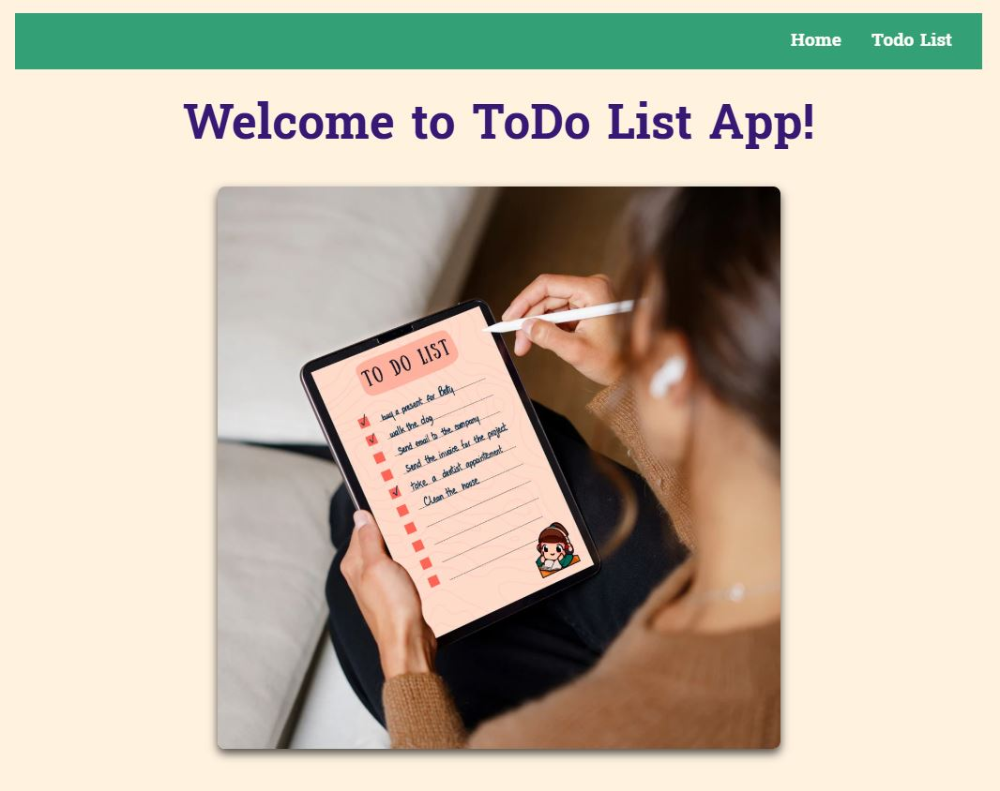
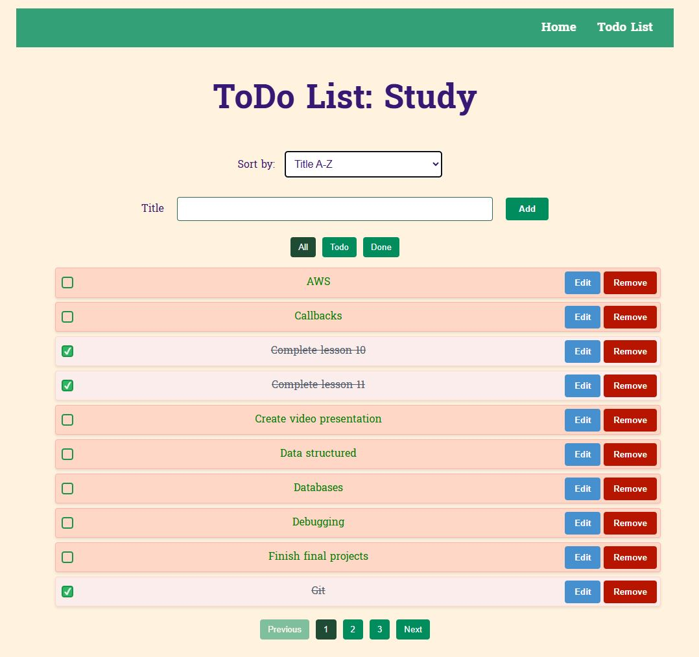
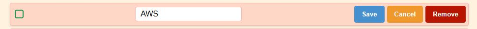

# ToDo List App 📝

ToDo List App built with **React** and **Vite**.

Easily create a list of things to do and track completion - perfect for tasks like a study list 📚.

## 🚀 Live Demo

<a href="https://react-todo-list-app-i58s.onrender.com/" target="_blank" rel="noopener noreferrer">View the Live App on Render</a>

🎥 Video Demo:

[Watch the Video Presentation](https://youtu.be/w16g1zziONQ)  

## 📂 Features

- Add, edit, and delete tasks 🎯
- Sort by title and by completion time 🔢 ⏰
- Filter tasks: All, ToDo, Done 🔍
- Mark tasks as completed ✅
- **Airtable** integration to save changes to the cloud ☁️
- Pagination for better task management 📋
- Responsive design for desktop and mobile 📱💻

## 📸 Screenshots

### 🏠 Home Page

### 📝 To-Do List

_View todo page with filters and sorting options._  

### ✏️ Editing a Task

_Inline editing of a task title with save/cancel options._  

## 🛠️ Technologies Used

- React ⚛️
- Vite ⚡
- JavaScript 🛠️
- Airtable (as a backend database) 📊
- CSS 🎨

## 💾 Installation

- git clone
- cd react-todo
- npm install
- npm run dev
- open in browser: visit [http://localhost:5173](http://localhost:5173)🚀
